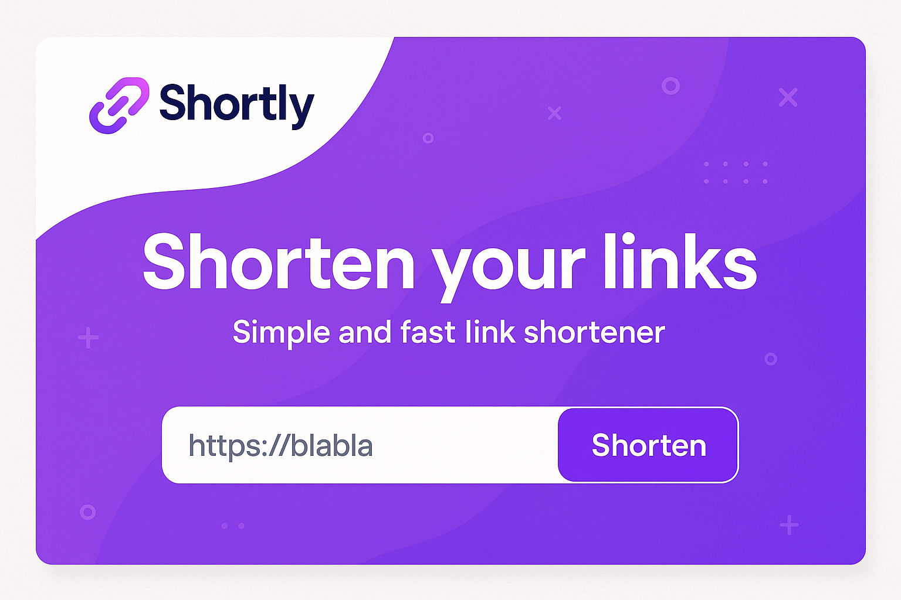

# Shortly - URL Shortener dengan Analytics

Shortly adalah aplikasi modern untuk memendekkan URL dengan fitur analytics lengkap, QR code generator, dan custom URL. Dibangun dengan React 19, TypeScript, dan Supabase.



## ✨ Fitur Utama

- 🔗 **URL Shortening** - Ringkas URL panjang jadi pendek dan mudah dibagikan
- 📊 **Analytics Dashboard** - Tracking clicks dengan detail device, lokasi, dan waktu
- 🎯 **Custom URL** - Bikin short URL sesuai keinginan kamu
- 📱 **QR Code Generator** - Generate QR code otomatis untuk setiap link
- 🌍 **Location Tracking** - Lihat dari mana aja orang ngakses link kamu
- 📱 **Device Detection** - Monitor device apa yang dipakai (mobile/desktop)
- 🔒 **Authentication** - Login aman dengan Supabase Auth
- 🌓 **Dark Theme** - UI modern dengan dark theme yang nyaman di mata
- ⚡ **Real-time Updates** - Data ter-update secara real-time

## 🛠️ Tech Stack

- **Frontend Framework:** React 19 + TypeScript
- **Build Tool:** Vite 7
- **Runtime:** Bun
- **Styling:** Tailwind CSS v4
- **UI Components:** Radix UI + shadcn/ui
- **Backend:** Supabase (Database + Auth)
- **Routing:** React Router v7
- **Icons:** Lucide React
- **QR Code:** react-qr-code + qrcode
- **Notifications:** Sonner
- **Deployment:** Netlify

## 🚀 Quick Start

### Prerequisites

Pastikan kamu sudah install:

- [Bun](https://bun.sh) (recommended) atau Node.js
- Git

### Installation

1. Clone repository ini:

```bash
git clone https://github.com/yourusername/link-short.git
cd link-short
```

2. Install dependencies:

```bash
bun install
```

3. Setup environment variables:

Buat file `.env` di root folder dan isi dengan:

```env
VITE_SUPABASE_URL=your_supabase_url
VITE_SUPABASE_ANON_KEY=your_supabase_anon_key
```

4. Jalankan development server:

```bash
bun run dev
```

5. Buka browser dan akses:

```
http://localhost:5173
```

## 📦 Available Scripts

```bash
# Development
bun run dev          # Jalankan dev server dengan hot reload

# Production Build
bun run build        # Build untuk production

# Preview Production Build
bun run preview      # Preview hasil build

# Linting
bun run lint         # Check code quality dengan ESLint
```

## 🗂️ Struktur Project

```
link-short/
├── src/
│   ├── components/      # Reusable UI components
│   │   ├── ui/         # shadcn/ui components
│   │   └── create-link.tsx
│   ├── pages/          # Page components
│   │   ├── Auth.tsx
│   │   ├── Dashboard.tsx
│   │   ├── LandingPage.tsx
│   │   ├── Link.tsx (Analytics)
│   │   └── RedirectLink.tsx
│   ├── context/        # React Context
│   ├── db/            # Database API functions
│   ├── hooks/         # Custom React hooks
│   ├── layouts/       # Layout components
│   ├── lib/           # Utility functions
│   └── main.tsx       # Entry point
├── public/            # Static assets
├── netlify.toml       # Netlify config
├── vite.config.ts     # Vite config
└── package.json
```

## 🎯 Fitur Detail

### 1. URL Shortening

- Input URL panjang dan dapat short URL yang mudah dibagikan
- Custom URL: pilih sendiri short URL yang kamu mau
- Auto-generate: sistem generate random short URL kalau ga set custom

### 2. QR Code

- Setiap link otomatis dapat QR code
- Download QR code dalam format PNG
- QR code sudah include full shortened URL

### 3. Analytics Dashboard

- **Total Clicks**: Monitor jumlah klik untuk setiap link
- **Device Breakdown**: Lihat perbandingan mobile vs desktop
- **Location Stats**: Track berdasarkan negara dan kota
- **Recent Activity**: List aktivitas terbaru dengan detail lengkap
- **Visual Charts**: Progress bar untuk visualisasi data

### 4. Link Management

- Search & filter links
- Copy short URL dengan satu klik
- Delete links yang ga diperlukan
- Edit dan customize links
- View detail analytics per link

## 🔑 Environment Variables

| Variable                 | Description            | Example                   |
| ------------------------ | ---------------------- | ------------------------- |
| `VITE_SUPABASE_URL`      | Supabase project URL   | `https://xxx.supabase.co` |
| `VITE_SUPABASE_ANON_KEY` | Supabase anonymous key | `eyJxxx...`               |

## 🗄️ Database Schema

### Table: `urls`

```sql
- id: uuid (PK)
- user_id: uuid (FK)
- original_url: text
- short_url: text
- custom_url: text (optional)
- title: text (optional)
- qr: text (QR code URL)
- created_at: timestamp
```

### Table: `clicks`

```sql
- id: uuid (PK)
- url_id: uuid (FK)
- created_at: timestamp
- city: text
- country: text
- device: text
```

## 🚀 Deployment

### Deploy ke Netlify

1. Push code ke GitHub
2. Connect repository ke Netlify
3. Set build command: `bun run build`
4. Set publish directory: `dist`
5. Add environment variables
6. Deploy!

File `netlify.toml` sudah dikonfigurasi untuk SPA routing.

### Deploy ke Vercel

```bash
vercel --prod
```

## 🎨 Customization

### Ubah Domain Short URL

Edit `fullShortUrl` di file berikut:

- `src/pages/Link.tsx` line 247
- `src/pages/Dashboard.tsx` line 277

Ganti `https://shortlyid.netlify.app/` dengan domain kamu.

### Ubah Theme Color

Primary color (purple) bisa diubah di `tailwind.config.js` atau langsung di class:

```
from-[#9043E5] to-[#7B35E6]
```

## 📱 Responsive Design

Shortly full responsive dan udah dioptimize untuk:

- Mobile (< 640px)
- Tablet (640px - 1024px)
- Desktop (> 1024px)

## 🔒 Security

- Authentication dengan Supabase Auth
- Row Level Security (RLS) di Supabase
- Protected routes
- Secure API calls
- Environment variables untuk sensitive data

## 🐛 Known Issues

- QR Code download kadang perlu refresh kalau gambar belum full load
- Analytics city tracking depend on IP geolocation accuracy

## 🤝 Contributing

Contributions are welcome! Feel free to:

1. Fork the project
2. Create your feature branch (`git checkout -b feature/AmazingFeature`)
3. Commit your changes (`git commit -m 'Add some AmazingFeature'`)
4. Push to the branch (`git push origin feature/AmazingFeature`)
5. Open a Pull Request

## 📝 License

This project is open source and available under the [MIT License](LICENSE).

## 👨‍💻 Author

Developed with ❤️ by Djib

## 🙏 Acknowledgments

- [shadcn/ui](https://ui.shadcn.com/) untuk UI components
- [Supabase](https://supabase.com/) untuk backend infrastructure
- [Radix UI](https://www.radix-ui.com/) untuk accessible components
- [Lucide](https://lucide.dev/) untuk beautiful icons
- [Tailwind CSS](https://tailwindcss.com/) untuk styling

---

⭐ Star this repo kalau kamu merasa terbantu!
